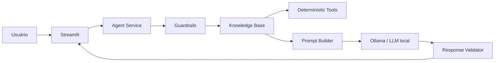

# 🤖 Assistente Virtual Financeiro


## Bootcamp Bradesco - GenAI, Dados & Cyber.


---


> Assistente financeiro educativo com IA generativa, dados mockados e guardrails determinísticos para transformar informações financeiras em explicações claras, contextualizadas e auditáveis.

[](https://github.com/Santosdevbjj/assistente-virtual-financeiro)
[](https://www.python.org/)
[](https://assistente-virtual-financeiro-com-ia.streamlit.app/)
[](https://ollama.com/)

## 1. Problema de negócio

Informações financeiras pessoais podem estar espalhadas entre transações, metas, perfil de risco e histórico de atendimento. O desafio não é apenas responder perguntas: é transformar esses dados em **contexto compreensível para apoiar educação e organização financeira**, sem inventar informações ou ultrapassar o limite de uma solução educacional.

O projeto parte do desafio proposto no material `DesafioProjetoBra01.pdf`, que pede um assistente capaz de conversar com a pessoa usuária, compreender uma necessidade e responder com base em informações organizadas, com atenção especial a segurança e anti-alucinação. fileciteturn0file0L24-L32

## 2. Objetivo

Construir um protótipo funcional que:

- conversa em linguagem natural;
- usa uma base de conhecimento fictícia;
- calcula indicadores financeiros de forma determinística;
- contextualiza explicações a partir do perfil e das transações;
- explica produtos financeiros disponíveis na base;
- mantém o papel de **educador**, não de consultor de investimentos;
- admite ausência de informação;
- bloqueia pedidos fora de escopo e solicitações de dados sensíveis;
- separa fatos calculados pelo código da geração textual do LLM.

O desafio original explicita que o assistente deve usar uma base de conhecimento, responder de forma simples e clara, evitar respostas inventadas e dizer quando não possui informação suficiente. fileciteturn1file0L41-L53

## 3. Caso de uso escolhido

### Educação financeira contextualizada

O assistente foi desenhado para o cenário de uma pessoa que deseja compreender melhor:

1. seus gastos;
2. sua evolução em relação às metas;
3. conceitos financeiros;
4. produtos existentes na base de conhecimento;
5. diferenças entre risco, liquidez e rentabilidade.

A escolha é deliberada: o projeto evita transformar um protótipo educacional em um sistema de recomendação de investimentos.

### O assistente faz

- analisa despesas por categoria;
- explica conceitos financeiros;
- explica produtos presentes na base;
- apresenta métricas calculadas a partir dos dados;
- contextualiza respostas com o perfil fictício;
- aponta lacunas de informação.

### O assistente não faz

- não executa operações financeiras;
- não acessa contas bancárias;
- não recebe credenciais;
- não recomenda compra ou venda de ativos;
- não promete rentabilidade;
- não inventa produtos, taxas ou dados;
- não substitui profissional habilitado.

O projeto de referência do desafio adota explicitamente a postura de ensinar, e não recomendar investimentos específicos. fileciteturn1file1L105-L119

## 4. Baseline

O baseline funcional é uma aplicação conversacional simples que carrega os quatro artefatos mockados do desafio e coloca o conteúdo no contexto do modelo.

Este projeto evolui esse baseline em três pontos:

| Baseline | Evolução deste projeto |
|---|---|
| Dados carregados diretamente no prompt | Camada de conhecimento tipada e reutilizável |
| LLM faz a interpretação | Cálculos financeiros críticos são determinísticos |
| Segurança concentrada no prompt | Guardrails antes e depois da geração |
| Um arquivo `app.py` | Arquitetura modular |
| Testes manuais | Testes automatizados + casos de avaliação |
| Sem observabilidade de domínio | Metadados de fonte e decisões de segurança |

O próprio material reconhece que simplesmente injetar os dados no prompt é uma abordagem inicial, enquanto soluções mais robustas podem consultar informações dinamicamente. fileciteturn2file12L719-L722

## 5. Estratégia da solução



### Princípio arquitetural

**O LLM interpreta e redige. O código calcula, valida e controla o escopo.**

Isso reduz a dependência de geração probabilística para operações que podem ser determinísticas, como:

- total de receitas;
- total de despesas;
- saldo do período;
- gastos por categoria;
- progresso de metas;
- lacuna para reserva de emergência.

## 6. Base de conhecimento

O desafio disponibiliza quatro arquivos mockados: transações, histórico de atendimento, perfil do investidor e produtos financeiros. fileciteturn1file3L260-L267

Este repositório mantém esses quatro arquivos na pasta `data/`:

| Arquivo | Uso |
|---|---|
| `transacoes.csv` | métricas de receitas e despesas |
| `historico_atendimento.csv` | contexto de interações anteriores |
| `perfil_investidor.json` | contexto do cliente fictício |
| `produtos_financeiros.json` | explicações dos produtos disponíveis |

**Importante:** os dados são fictícios e devem ser tratados como um snapshot de demonstração, não como dados financeiros reais.

## 7. Decisões técnicas

### Python

Escolhido porque concentra processamento de dados, aplicação web, testes e integração com LLM em um ecossistema único.

### Streamlit

Escolhido para reduzir o tempo entre implementação e demonstração. O desafio sugere Streamlit ou Gradio para o chatbot. fileciteturn1file0L77-L82

**Trade-off:** Streamlit simplifica a interface, mas não pretende ser a camada final de uma plataforma financeira de produção.

### Ollama

O modo padrão pode usar LLM local. O material de referência demonstra esse caminho e destaca a vantagem de não enviar os dados mockados para uma API externa. fileciteturn1file6L403-L407

**Trade-off:** execução local reduz exposição de dados, mas depende de recursos computacionais e de um modelo compatível instalado.

### Guardrails determinísticos

Regras de segurança não ficam exclusivamente no prompt. O código classifica pedidos sensíveis, fora de escopo e pedidos de recomendação.

**Trade-off:** regras determinísticas podem gerar falsos positivos; por outro lado, tornam o comportamento crítico testável.

### Sem LangChain na primeira versão

O desafio apresenta LangChain, LangFlow e CrewAI como opções de orquestração. fileciteturn1file0L100-L112

A primeira versão não usa um framework de agentes porque o fluxo possui poucas etapas. Adicionar abstrações antes de existir uma necessidade operacional aumentaria o custo de manutenção.

## 8. Estrutura do repositório

```text
assistente-virtual-financeiro/
├── .github/workflows/ci.yml
├── .streamlit/config.toml
├── assets/
│   ├── architecture.mmd
│   └── README.md
├── data/
│   ├── historico_atendimento.csv
│   ├── perfil_investidor.json
│   ├── produtos_financeiros.json
│   └── transacoes.csv
├── docs/
│   ├── 00-visao-projeto.md
│   ├── 01-documentacao-agente.md
│   ├── 02-base-conhecimento.md
│   ├── 03-prompts.md
│   ├── 04-metricas.md
│   ├── 05-pitch.md
│   ├── 06-11-framework-cds.md
│   ├── 07-decisoes-tecnicas.md
│   └── 08-seguranca.md
├── examples/README.md
├── scripts/validate_data.py
├── src/
│   ├── app.py
│   ├── requirements.txt
│   └── assistant/
│       ├── __init__.py
│       ├── analytics.py
│       ├── config.py
│       ├── guardrails.py
│       ├── knowledge.py
│       ├── llm.py
│       ├── prompts.py
│       ├── schemas.py
│       └── service.py
├── tests/
│   ├── conftest.py
│   ├── test_analytics.py
│   ├── test_guardrails.py
│   ├── test_knowledge.py
│   └── test_service.py
├── .env.example
├── .gitignore
├── Dockerfile
├── LICENSE
├── Makefile
├── pyproject.toml
└── README.md
```

## 9. Como executar

### Pré-requisitos

- Python 3.12+
- Git
- Ollama, se quiser usar o modo LLM local

### Ambiente Python

```bash
python -m venv .venv
```

Windows:

```powershell
.venv\Scripts\Activate.ps1
```

Linux/macOS:

```bash
source .venv/bin/activate
```

Instale:

```bash
pip install -r src/requirements.txt
```

### Executar

```bash
streamlit run src/app.py
```

O aplicativo funciona sem LLM para os cenários determinísticos. Para habilitar o modelo local, copie `.env.example` para `.env` e altere:

```env
LLM_ENABLED=true
```

Depois:

```bash
ollama pull gpt-oss
ollama serve
```

### Testes

```bash
pytest -q
```

### Validação dos dados

```bash
python scripts/validate_data.py
```

## 10. Métricas de avaliação

O desafio propõe três métricas principais:

- **Assertividade:** respondeu o que foi perguntado?
- **Segurança:** evitou inventar informação?
- **Coerência:** a resposta é compatível com o perfil e contexto?

Essas três dimensões estão descritas no material do desafio. fileciteturn1file10L608-L623

Este projeto acrescenta métricas técnicas:

- taxa de testes determinísticos aprovados;
- taxa de bloqueio de pedidos fora de escopo;
- taxa de respostas sem fonte de dados;
- latência do LLM, quando habilitado.

Não são apresentados resultados de produção como se fossem evidência real. Os números obtidos nos testes locais devem ser gerados pelo ambiente de execução.

## 11. Resultado esperado

Uma pessoa avaliando o repositório deve conseguir responder rapidamente:

- qual problema foi escolhido;
- qual é o limite do produto;
- quais dados entram;
- onde ocorre o cálculo;
- onde o LLM entra;
- como a segurança funciona;
- como testar;
- quais trade-offs foram aceitos;
- o que seria necessário para produção.

Esse é o objetivo de documentação: tornar o raciocínio técnico legível, e não apenas listar tecnologias.

## 12. Aprendizados

O principal aprendizado arquitetural é que **usar IA não significa delegar toda a lógica para o modelo**.

Em um domínio sensível, uma arquitetura mais controlável separa:

1. dados;
2. cálculos;
3. políticas;
4. contexto;
5. geração;
6. validação;
7. interface.

O projeto também evidencia uma diferença importante entre protótipo e produção: uma solução pode demonstrar o fluxo completo sem alegar que já possui os controles necessários para operar com dados bancários reais.

## 13. Próximos passos

- adicionar suíte de avaliação baseada em dataset de perguntas;
- medir latência e custo por interação;
- implementar RAG quando a base crescer;
- adicionar tracing de prompts e respostas;
- criar autenticação;
- separar API e frontend;
- adicionar controle de acesso;
- substituir dados mockados por uma fonte segura e autorizada;
- implementar revisão humana para fluxos de maior risco;
- criar testes de regressão de prompts;
- avaliar modelos locais diferentes;
- publicar screenshots e vídeo do pitch.

## 14. Pitch

O roteiro de até três minutos está em [`docs/05-pitch.md`](docs/05-pitch.md). O desafio orienta dividir a apresentação entre problema, solução, demonstração e diferencial/impacto. fileciteturn1file8L548-L568

## 15. Limitações

Este é um projeto de portfólio e demonstração técnica.

Ele **não** deve ser usado para:

- aconselhamento financeiro individual real;
- execução de investimentos;
- movimentação de dinheiro;
- processamento de credenciais;
- análise de dados bancários reais;
- decisões automatizadas de crédito;
- cumprimento de obrigações regulatórias de uma instituição financeira.

A base de dados fornecida pelo desafio é fictícia e foi usada como material de demonstração. fileciteturn1file3L260-L267

## Licença

MIT. Consulte [`LICENSE`](LICENSE).


--- 
   
**Autor:** Sérgio Santos — Cientista de Dados | Ambientes Críticos e Governança de Dados

[](https://portfoliosantossergio.vercel.app)
[](https://linkedin.com/in/santossergioluiz)
