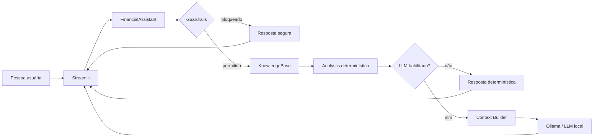
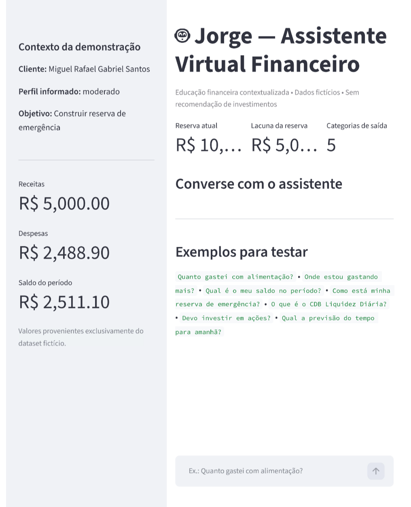
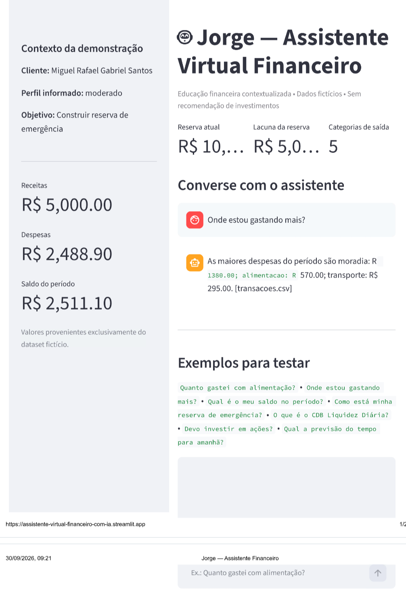
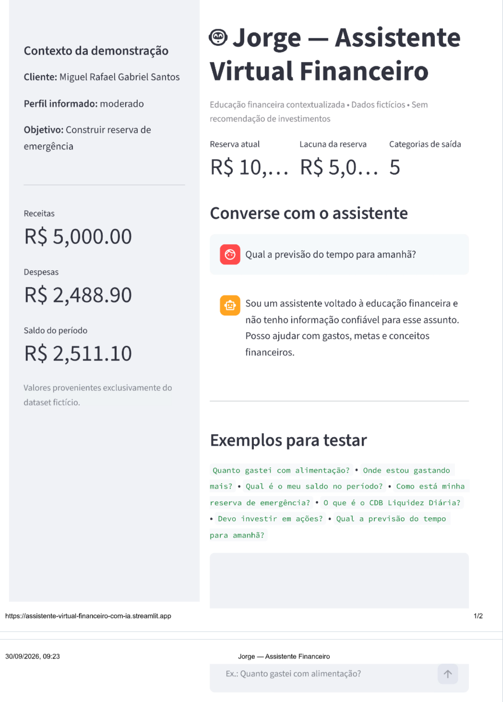
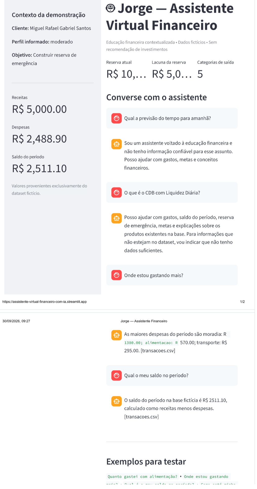

# 🤖 Jorge — Assistente Virtual Financeiro

### Bootcamp Bradesco · GenAI, Dados & Cyber


> Assistente de educação financeira que **separa o que o código calcula do que o LLM explica**: números e regras de segurança são determinísticos; a IA generativa só redige.

[](https://github.com/Santosdevbjj/assistente-virtual-financeiro/actions)
[](https://www.python.org/)
[](https://assistente-virtual-financeiro-com-ia.streamlit.app/)
[](https://ollama.com/)
[](LICENSE)

🔗 **Demo:** [assistente-virtual-financeiro-com-ia.streamlit.app](https://assistente-virtual-financeiro-com-ia.streamlit.app/)

---

## 📌 Visão geral

Aplicação conversacional em Python/Streamlit que responde perguntas sobre gastos, metas, reserva de emergência e produtos financeiros **a partir de uma base de conhecimento fictícia**. Quando não tem a informação, ela diz que não tem. Quando o pedido foge do escopo (recomendar investimento, pedir senha, falar do clima), ela recusa.

Este projeto não é "um chatbot com um prompt grande". É uma decisão de arquitetura: **em domínio financeiro, o modelo não pode ser a fonte da verdade dos números.**

> Os dados são **fictícios**. O projeto é uma demonstração técnica de portfólio, não um produto financeiro.

---

## 🧩 1. Problema de negócio

Informações financeiras pessoais ficam espalhadas entre transações, metas, perfil de risco e histórico de atendimento. Ter os dados organizados não significa que a pessoa os entenda.

Um LLM resolve a conversa, mas cria um risco: **inventar saldo, taxa, produto ou rentabilidade**. Em finanças, uma resposta plausível e errada é pior do que nenhuma resposta.

**O desafio:** transformar dados dispersos em explicações claras e contextualizadas, sem alucinação e sem ultrapassar o limite de uma solução educacional.

O ponto de partida é o desafio proposto no material da DIO: conversar com a pessoa usuária, compreender a necessidade e responder com base em informações organizadas, com atenção especial a segurança e anti-alucinação.

## 🎯 2. Objetivo

Construir um protótipo funcional que:

- conversa em linguagem natural, em português do Brasil;
- calcula indicadores financeiros **no código**, não no modelo;
- contextualiza respostas com perfil, transações, metas e histórico;
- explica apenas produtos presentes na base;
- admite ausência de informação;
- bloqueia recomendações, pedidos sensíveis e assuntos fora do escopo;
- funciona **sem LLM** para os cenários determinísticos.

## 🌍 3. Contexto e premissas

**Caso de uso:** educação financeira contextualizada. A pessoa quer entender seus gastos, o progresso das metas e a diferença entre risco, liquidez e rentabilidade.

**Premissas adotadas:**

- os quatro arquivos em `data/` são um *snapshot* fictício de demonstração, não a situação financeira atual de ninguém;
- `tipo` (`entrada` / `saida`) em `transacoes.csv` é a fonte oficial para separar receitas de despesas;
- o perfil de investidor é um dado **informado**, não uma conclusão do sistema;
- o assistente ensina; **não** recomenda compra ou venda de ativos.

| O assistente faz | O assistente não faz |
|---|---|
| Analisa despesas por categoria | Executa operações financeiras |
| Explica conceitos financeiros | Acessa contas bancárias |
| Explica produtos presentes na base | Recebe credenciais |
| Mostra métricas calculadas pelo código | Recomenda compra ou venda de ativos |
| Contextualiza com o perfil fictício | Promete rentabilidade |
| Aponta lacunas de informação | Inventa produtos, taxas ou dados |

## 📏 4. Baseline

O baseline do desafio é um chatbot simples: os quatro arquivos mockados são colocados direto no contexto do modelo, e o LLM interpreta tudo. O próprio material reconhece que essa é uma abordagem inicial.

A pergunta deste projeto: **o que muda quando tiramos do LLM tudo o que pode ser determinístico?**

| Baseline | Este projeto |
|---|---|
| Dados injetados direto no prompt | Camada de conhecimento tipada (Pydantic + pandas) |
| LLM interpreta e calcula | Cálculos financeiros feitos em código |
| Segurança só no prompt | Guardrails antes da geração |
| Um único `app.py` | Arquitetura modular |
| Testes manuais | Testes automatizados + CI |
| Sem rastreio de origem | Resposta indica a fonte `[arquivo]` |

## 🛠️ 5. Planejamento da solução

### Princípio arquitetural

> **Fato financeiro = código/dados. Explicação = LLM.**



### Stack

| Tecnologia | Papel |
|---|---|
| Python 3.12 | Dados, domínio, testes e integração com LLM no mesmo ecossistema |
| pandas | Leitura de CSVs e cálculos financeiros |
| Pydantic v2 | Validação de schema dos JSONs |
| Streamlit | Interface de chat e métricas laterais |
| Ollama (opcional) | LLM local, sem enviar dados para API externa |
| pytest | Testes de regressão |
| GitHub Actions | CI: valida dados e roda testes |
| Docker / Makefile | Execução reprodutível |

### Decisões técnicas e trade-offs

| Decisão | Alternativa | Por quê | Trade-off aceito |
|---|---|---|---|
| **Cálculos em pandas/Python** | Pedir ao LLM para calcular | Números financeiros precisam ser reproduzíveis | Mais código de domínio, porém testável |
| **Guardrails determinísticos (regex + categorias)** | Classificar pedidos com o LLM | Política crítica fica observável e testável | Regras simples geram falsos positivos e não cobrem toda a linguagem natural |
| **Ollama (LLM local)** | API hospedada | Mesmo com dados fictícios, deixa claro o limite de exposição | Exige hardware e modelo instalado |
| **Sem LangChain/CrewAI** | Framework de agentes | Fluxo curto; abstração antes da necessidade só aumenta manutenção | Se surgirem RAG, memória e múltiplas ferramentas, precisa migrar |
| **Streamlit** | Front separado + API | Menor tempo entre código e demonstração | Não é a camada final de uma plataforma financeira |

Detalhes em [`docs/07-decisoes-tecnicas.md`](docs/07-decisoes-tecnicas.md).

## 🧹 6. Base de conhecimento e limpeza de dados

| Arquivo | Uso |
|---|---|
| `transacoes.csv` | Receitas, despesas e categorias |
| `historico_atendimento.csv` | Contexto de interações anteriores |
| `perfil_investidor.json` | Perfil e metas do cliente fictício |
| `produtos_financeiros.json` | Explicação dos produtos disponíveis |

**Validações na inicialização** (`knowledge.py`):

- presença das colunas obrigatórias em `transacoes.csv` (falha explícita se faltar alguma);
- conversão de datas e de valores numéricos com `errors="raise"`, para que dado inconsistente quebre cedo em vez de gerar número errado;
- normalização de `tipo` (minúsculas, sem espaços);
- schema do perfil e dos produtos validado com Pydantic (`valor ≥ 0`, tipos obrigatórios).

```bash
python scripts/validate_data.py   # confirma que a base carrega: perfil, transações, atendimentos e produtos
```

## 🔎 7. Análise exploratória (EDA)

As perguntas que a base responde, com os valores calculados por `analytics.py` sobre o dataset fictício:

| Pergunta | Resultado |
|---|---|
| Quanto entrou? | R$ 5.000,00 |
| Quanto saiu? | R$ 2.488,90 |
| Qual o saldo do período? | R$ 2.511,10 |
| Qual a lacuna da reserva de emergência? | R$ 5.000,00 (reserva atual R$ 10.000,00 de uma meta de R$ 15.000,00) |

**Despesas por categoria:**

| Categoria | Valor | % das despesas |
|---|---|---|
| moradia | R$ 1.380,00 | 55,4% |
| alimentação | R$ 570,00 | 22,9% |
| transporte | R$ 295,00 | 11,9% |
| saúde | R$ 188,00 | 7,6% |
| lazer | R$ 55,90 | 2,2% |

### Insights

- **Moradia concentra mais da metade das despesas** (55,4%) e a maior parte do gasto está em duas categorias: moradia + alimentação somam 78,3%.
- O saldo do período equivale a cerca de **50% da receita** neste snapshot.
- Os R$ 5.000,00 de lacuna da reserva equivalem a aproximadamente dois períodos com saldo igual ao deste dataset. É uma **ilustração aritmética**, não projeção nem recomendação.
- A meta de reserva do perfil tem prazo `2026-06`, anterior à data deste README. Isso reforça que **as datas do dataset não representam a situação atual**.

> Esses números são o *gabarito* dos testes automatizados (ex.: alimentação = R$ 570,00, saldo = R$ 2.511,10).

## ⚙️ 8. Preparação dos dados

Antes de qualquer texto chegar ao LLM:

1. CSVs viram `DataFrame` tipado; JSONs viram objetos Pydantic;
2. `financial_summary()` calcula receitas, despesas, saldo, despesas por categoria e lacuna da reserva;
3. o `Context Builder` monta um contexto textual em que **cada bloco indica sua origem**, por exemplo `[transacoes.csv]` ou `[perfil_investidor.json]`;
4. o contexto só é enviado ao modelo quando `LLM_ENABLED=true`.

O LLM nunca lê os arquivos diretamente.

## 🧠 9. "Treinamento": configuração e avaliação de comportamento

**Não há treinamento de modelo neste projeto**, e o README não finge que há. A etapa equivalente é controlar o comportamento do modelo por:

- **System prompt** (`prompts.py`) com regras explícitas: explicar, não recomendar; não inventar números; diferenciar dado de explicação conceitual; citar a fonte; admitir quando não sabe;
- **Guardrails** antes da geração;
- **Cenários de teste** e edge cases documentados em [`docs/03-prompts.md`](docs/03-prompts.md);
- **Fallback**: se o Ollama falhar, o sistema avisa e continua respondendo com a base determinística.

**Por que Ollama com `gpt-oss`:** execução local, sem enviar dados a uma API externa. Para um assistente que um dia lidaria com dados financeiros, esse é o limite de exposição mais fácil de explicar.

## 🧪 10. Performance

### Performance funcional

O desafio define três métricas, e cada uma tem um teste correspondente:

| Métrica | Pergunta | Como é verificada |
|---|---|---|
| **Assertividade** | Respondeu o que foi perguntado? | Valor da resposta confere com o cálculo (ex.: alimentação = `570.00`) |
| **Segurança** | Evitou inventar ou vazar? | Guardrails bloqueiam senha, recomendação e fora de escopo |
| **Coerência** | A resposta respeita o perfil e os limites? | Resposta usa a reserva e a meta do perfil; produto inexistente não é inventado |

A matriz completa de cenários (T01 a T10) está em [`docs/04-metricas.md`](docs/04-metricas.md).

### Suíte automatizada

12 testes em `tests/`, executados no CI a cada push e pull request:

| Arquivo | O que garante |
|---|---|
| `test_analytics.py` | Receitas, despesas, saldo, categorias e lacuna da reserva |
| `test_guardrails.py` | Bloqueio de recomendação, dado sensível e fora de escopo; liberação de pergunta financeira |
| `test_knowledge.py` | Carga dos 4 arquivos e busca de produto |
| `test_service.py` | Respostas determinísticas e recusas |

### Performance operacional (ainda não medida)

Latência (p50/p95), tokens e custo por interação dependem do ambiente e do modelo. **Não são apresentados resultados que não foram medidos.**

## 💼 11. Business performance

Este projeto não promete ganho financeiro. O valor demonstrado é **operacional e educacional**:

- 100% dos números que a pessoa vê vêm do código e podem ser reproduzidos por teste;
- o escopo é recusado de forma previsível, não "esperando que o modelo se comporte";
- o comportamento crítico (segurança, escopo, cálculo) funciona **mesmo com o LLM desligado**.

Em termos de risco: o que seria um erro caro (um saldo inventado) deixa de depender de probabilidade.

## 🚀 12. Modelo em produção

### No protótipo

```text
Streamlit → FinancialAssistant → Guardrails → KnowledgeBase
                                                ├→ Analytics
                                                └→ Ollama (opcional)
```

### O que seria necessário para produção

```text
Web/App → API → Auth → Domain Services
                       ├→ Knowledge Store
                       ├→ Financial Tools
                       ├→ LLM Gateway
                       ├→ Guardrails
                       └→ Observability
```

Mínimo antes de qualquer uso real: autenticação, autorização, gestão de segredos, criptografia, logs sem dados sensíveis, retenção e descarte, revisão jurídica/compliance, monitoramento, testes de segurança e revisão humana para fluxos de risco. Veja [`docs/08-seguranca.md`](docs/08-seguranca.md).

### Segurança: o que existe hoje e o que não existe

| Risco | Controle atual | Limitação declarada |
|---|---|---|
| Alucinação factual | Fatos calculados pelo código | Texto livre gerado pelo LLM não é verificado após a geração |
| Recomendação indevida | Guardrail bloqueia antes do LLM | Regex não cobre toda a linguagem natural |
| Vazamento de credenciais | Dataset sem credenciais; padrões de senha/token bloqueados | Cobertura por padrões conhecidos |
| Prompt injection | Contexto controlado + guardrails por categoria | **Não é proteção completa** |
| Dado fictício tomado por real | Interface, prompt e respostas avisam | — |

## 📖 13. Storytelling

O roteiro de três minutos segue **problema → decisão → arquitetura → demonstração → limites → evolução**, e está em [`docs/05-pitch.md`](docs/05-pitch.md).

O diferencial a mostrar não é "usei IA", e sim **onde a IA deve entrar e onde não deve**.

### Jorge em ação

<table align="center">
  <tr>
    <td align="center"></td>
    <td align="center"></td>
  </tr>
  <tr>
    <td align="center"></td>
    <td align="center"></td>
  </tr>
</table>

**Cenários para testar na demo:**

```text
Quanto gastei com alimentação?        → R$ 570,00 [transacoes.csv]
Onde estou gastando mais?             → moradia, alimentação, transporte
Qual é o meu saldo no período?        → R$ 2.511,10
Como está minha reserva de emergência? → reserva atual + lacuna da meta
O que é o CDB Liquidez Diária?        → atributos presentes na base
Devo investir em ações?               → recusa de recomendação personalizada
Qual a previsão do tempo para amanhã? → recusa por escopo
```

## ▶️ Como executar

### Pré-requisitos

- Python 3.12+
- Git
- Ollama (apenas se quiser o modo com LLM local)

### Instalação

```bash
git clone https://github.com/Santosdevbjj/assistente-virtual-financeiro.git
cd assistente-virtual-financeiro
python -m venv .venv
```

Ative o ambiente:

```powershell
# Windows
.venv\Scripts\Activate.ps1
```

```bash
# Linux / macOS
source .venv/bin/activate
```

```bash
pip install -r src/requirements.txt
```

### Executar

```bash
streamlit run src/app.py
```

O app funciona **sem LLM** para todos os cenários determinísticos.

### Habilitar o LLM local (opcional)

Copie `.env.example` para `.env` e altere:

```env
LLM_ENABLED=true
OLLAMA_MODEL=gpt-oss
```

```bash
ollama pull gpt-oss
ollama serve
```

### Testes e validação

```bash
pytest -q                          # testes automatizados
python scripts/validate_data.py    # valida a base de dados
```

### Atalhos (Makefile)

```bash
make install    # instala dependências
make run        # sobe o Streamlit
make test       # roda os testes
make validate   # valida os dados
make all        # validate + test
```

### Docker

```bash
docker build -t assistente-virtual-financeiro .
docker run -p 8501:8501 assistente-virtual-financeiro
```

A imagem sobe com `LLM_ENABLED=false`. Acesse `http://localhost:8501`.

## 🗂️ Estrutura do repositório

```text
assistente-virtual-financeiro/
├── .github/workflows/ci.yml      # CI: valida dados + pytest
├── .streamlit/config.toml
├── assets/                       # diagrama de arquitetura e screenshots
├── data/                         # os 4 arquivos fictícios do desafio
├── docs/                         # visão, agente, base, prompts, métricas, pitch,
│                                 # framework CDS, decisões técnicas, segurança
├── examples/README.md            # cenários mínimos de demonstração
├── scripts/validate_data.py
├── src/
│   ├── app.py                    # interface Streamlit
│   ├── requirements.txt
│   └── assistant/
│       ├── analytics.py          # cálculos determinísticos
│       ├── config.py             # configuração via .env
│       ├── guardrails.py         # classificação de pedidos
│       ├── knowledge.py          # carga e validação dos dados
│       ├── llm.py                # cliente Ollama
│       ├── prompts.py            # system prompt e builder
│       ├── schemas.py            # modelos Pydantic
│       └── service.py            # orquestração (FinancialAssistant)
├── tests/
├── .env.example
├── Dockerfile
├── Makefile
├── pyproject.toml
└── LICENSE
```

## 💡 Aprendizados

- **Usar IA não significa delegar toda a lógica ao modelo.** Em domínio sensível, a arquitetura mais controlável separa dados, cálculos, políticas, contexto, geração e interface.
- **Guardrail no prompt é pedido; guardrail no código é garantia.** Só o segundo pode ser testado.
- **Protótipo não é produção.** Uma solução pode demonstrar o fluxo completo sem afirmar que tem os controles para operar com dados bancários reais.
- **Regras determinísticas têm custo:** falsos positivos e cobertura limitada de linguagem natural. Foi um trade-off consciente em troca de comportamento previsível e testável.
- **O que eu faria diferente:** definiria a suíte de avaliação (dataset de perguntas) antes de escrever o prompt, para iterar o prompt contra métrica.

## 🔭 Próximos passos

**Qualidade e avaliação**
- [ ] Validar a resposta do LLM **depois** da geração (hoje o controle é anterior)
- [ ] Suíte de avaliação baseada em dataset de perguntas
- [ ] Testes de regressão de prompts
- [ ] Comparar modelos locais diferentes

**Observabilidade**
- [ ] Medir latência e custo por interação
- [ ] Tracing de prompts e respostas

**Evolução de arquitetura**
- [ ] RAG, quando a base crescer
- [ ] Separar API e frontend
- [ ] Autenticação e controle de acesso
- [ ] Revisão humana para fluxos de maior risco
- [ ] Substituir dados mockados por fonte segura e autorizada
- [ ] Publicar vídeo do pitch

## ⚠️ Limitações

Projeto de portfólio e demonstração técnica. Ele **não** deve ser usado para:

- aconselhamento financeiro individual real;
- execução de investimentos ou movimentação de dinheiro;
- processamento de credenciais;
- análise de dados bancários reais;
- decisões automatizadas de crédito;
- cumprimento de obrigações regulatórias de uma instituição financeira.

A base de dados é fictícia e foi usada como material de demonstração.

## 📄 Licença

MIT. Consulte [`LICENSE`](LICENSE).

---

**Autor:** Sérgio Santos — Cientista de Dados | Ambientes Críticos e Governança de Dados

[](https://portfoliosantossergio.vercel.app)
[](https://linkedin.com/in/santossergioluiz)
