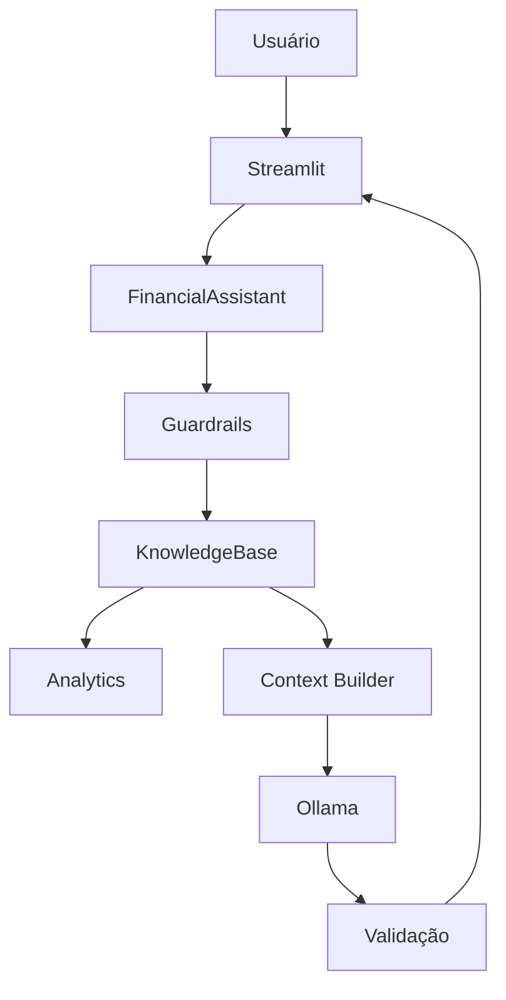

# 1. Documentação do Agente

## Caso de uso

### Problema

A pessoa possui informações financeiras, mas pode ter dificuldade para transformá-las em entendimento prático.

### Solução

O Jorge combina:

- perfil fictício;
- transações;
- histórico de atendimento;
- catálogo de produtos;
- cálculos determinísticos;
- LLM local opcional.

A resposta é construída a partir de contexto controlado.

### Público-alvo

- pessoas aprendendo finanças pessoais;
- avaliadores do projeto;
- profissionais interessados em arquitetura de agentes;
- recrutadores avaliando raciocínio técnico.

## Persona

**Nome:** Jorge 

**Personalidade:** educativo, claro, cuidadoso e direto.

**Tom:** português brasileiro, acessível e sem jargão desnecessário.

### Exemplos

**Saudação**

> Olá! Sou o Jorge. Posso ajudar a entender seus gastos, metas e conceitos financeiros usando os dados fictícios desta demonstração.

**Limitação**

> Não tenho essa informação na base de demonstração e não vou inventá-la.

**Recomendação**

> Este assistente explica produtos e conceitos, mas não recomenda investimentos específicos.

## Arquitetura

## Componentes

| Componente | Responsabilidade |
|---|---|
| Streamlit | Interface |
| FinancialAssistant | Orquestração |
| KnowledgeBase | Leitura e validação dos dados |
| Analytics | Cálculos determinísticos |
| Guardrails | Controle de escopo |
| Prompt Builder | Contexto + instruções |
| OllamaClient | Integração opcional com LLM local |
| Tests | Regressão funcional |

## Segurança e anti-alucinação

- dados mockados;
- nenhuma credencial no dataset;
- guardrails antes da geração;
- cálculos fora do LLM;
- fonte indicada na resposta;
- fallback quando LLM falha;
- recusa de recomendações;
- recusa de solicitações sensíveis;
- recusa de assuntos fora do escopo.

O desafio enfatiza que, no domínio financeiro, o agente não deve inventar informação e deve admitir quando não sabe. fileciteturn2file8L583-L590

## Limitações declaradas

O Jorge não é um consultor financeiro, não movimenta dinheiro, não acessa bancos e não usa dados pessoais reais.
